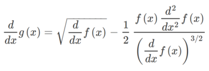

# Introdução

O método de Halley é usado para busca de raizes de funções reais de uma variável que possuem primeira e segunda derivada contínuas, realizando iterativamente uma sequência de aproximações à raiz, tendo uma taxa de convergência cúbica. Criado pelo fisíco Edmond Halley, o algoritmo consiste em aplicar o método de Newton-Raphson duas vezes. Esse segundo método, desenvolvido por Isaac Newton e Joseph Raphson, estima as raízes de uma função escolhendo-se uma aproximação inicial. Cria-se então um método iterativo, repetindo o processo de cálculo da reta tangente a partir da derivada da função no ponto e a intersecção dela com o eixo das abcissas. Abaixo é possível ver a representação gráfica e matemática do Método de Newton-Raphson.

     

# Desenvolvimento

Considere a função de iteração:&nbsp;&nbsp;&nbsp;&nbsp; &nbsp;&nbsp;&nbsp;&nbsp;&nbsp;&nbsp;&nbsp;, onde &nbsp;&nbsp;&nbsp;&nbsp;&nbsp; &nbsp;&nbsp;&nbsp;&nbsp; e Q é um polinômio.  
O Método de Halley diz que se Q for uma função linear, então é possível obter uma função de terceira ordem, obedecendo a forma do método de Newton-Raphson. Supondo uma função g tal que:  
  
A função f é aquela cuja raiz tal que f(x)=0 queremos encontrar. Agora derivamos a função g, gerando a expressão:  
  
Simplificando:  
  
Agora usaremos a função de iteração do método de Newton-Raphson. Contudo, ao invés de utilizarmos a função f e a sua derivada na busca da raiz, usaremos as expressões derivadas de g, ou seja:  
&nbsp;&nbsp;&nbsp;&nbsp;onde,&nbsp;&nbsp;&nbsp;&nbsp;  
Aplicando a equação encontrada anteriormente com a função de iteração obtemos a expressão usada pelo método de Halley:  
